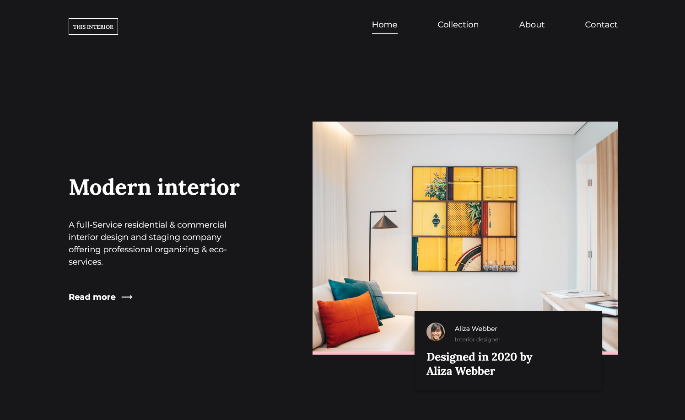

# Dev Challenges - Page 404

This is a solution to the [Interior consultant challenge on Dev Challenges](https://devchallenges.io/challenges/Jymh2b2FyebRTUljkNcb#). Create a homepage following the design. The page should be responsive.

Fulfill user stories below:

- User story: I can see a page following the given design
- User story: On mobile, I can see a collapsed navigation
- User story: On mobile, when I select the hamburger menu, I can see a navigation

## Table of contents

- [Overview](#overview)
  - [The challenge](#the-challenge)
  - [Screenshot](#screenshot)
  - [Links](#links)
- [My process](#my-process)
  - [Built with](#built-with)
- [Author](#author)

## Overview

### Screenshot

### Links

- Solution URL: [Repo](https://github.com/karinaestaba/interior-consultant.git)
- Live Site URL: [Demo](https://karinaestaba.github.io/interior-consultant)

## My process

### Built with

- Semantic HTML5 markup
- CSS custom properties
- Flexbox, CSS GRID
- Sass

## Author

- Website - [Karina Estaba]
- Dev Challenges - [@karinaestaba](https://devchallenges.io/portfolio/karinaestaba)